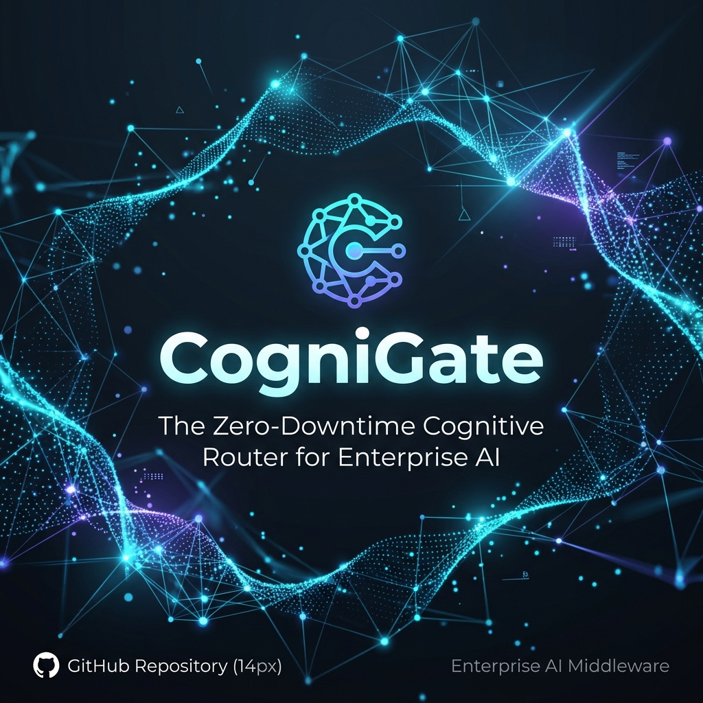
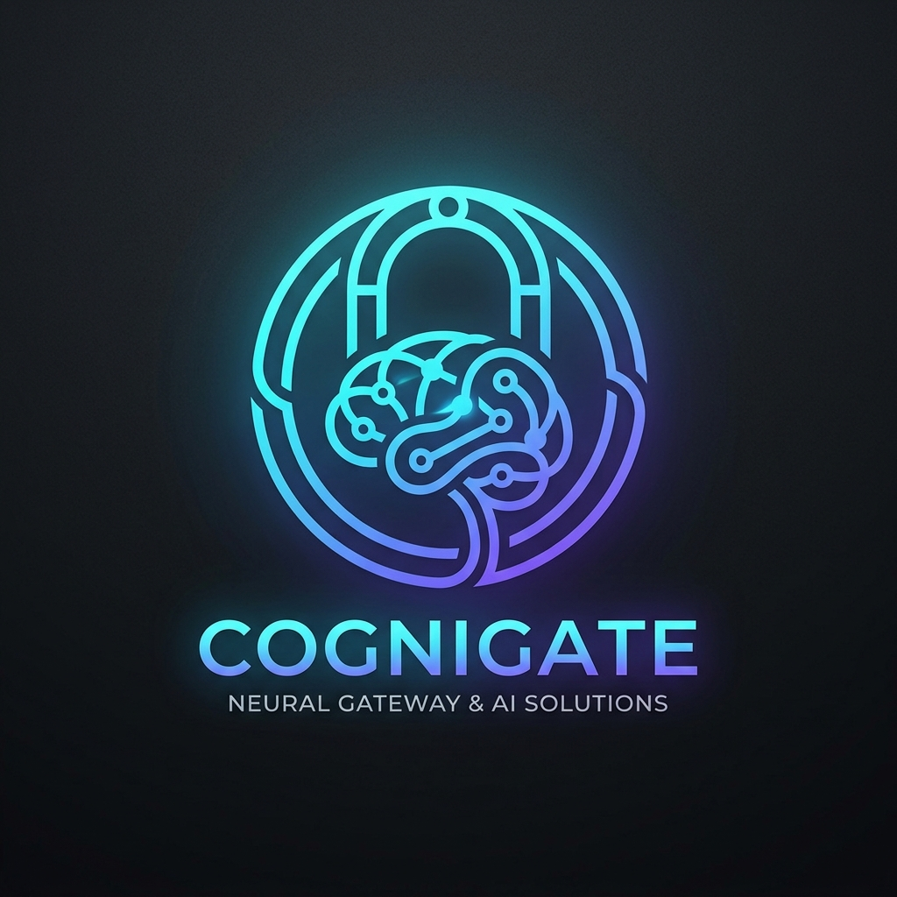

<div align="center">

<p align="center">
  
</p>

<h1>
  <br/>
  CogniGate
</h1>

<p><strong>The Zero-Downtime Cognitive Router for Enterprise AI</strong></p>

<p>
  <em>Self-hosted · Multi-tenant · OpenAI-compatible · Open Source</em>
</p>

<p>
  <a href="https://github.com/Life-Experimentalist/CogniGate/actions/workflows/ci.yml">
    
  </a>
  <a href="https://github.com/Life-Experimentalist/CogniGate/releases">
    
  </a>
  <a href="LICENSE">
    
  </a>
  <a href="https://github.com/Life-Experimentalist/CogniGate/stargazers">
    
  </a>
</p>

<p>
  <a href="https://life-experimentalist.github.io/CogniGate">📖 Documentation</a> ·
  <a href="https://github.com/Life-Experimentalist/CogniGate/issues/new?template=bug_report.yml">🐛 Report Bug</a> ·
  <a href="https://github.com/Life-Experimentalist/CogniGate/issues/new?template=feature_request.yml">✨ Request Feature</a> ·
  <a href="https://github.com/Life-Experimentalist/CogniGate/discussions">💬 Discussions</a>
</p>

</div>

---

## What Is CogniGate?

CogniGate is a **self-hosted enterprise AI infrastructure platform** that sits between your applications and LLM providers (OpenAI, Anthropic, Groq, Mistral, etc.). It is the open-source alternative to OpenRouter and LiteLLM — built for organizations that need full control over their AI traffic.

### Key Capabilities

| Feature | Description |
|---|---|
| **OpenAI-Compatible API** | Drop-in replacement — zero client code changes |
| **Zero-Downtime Key Rotation** | Redis-backed atomic key cycling with instant cache invalidation |
| **Circuit Breaker & Failover** | Exponential backoff on 429/5xx with automatic cascade to backup models |
| **Multi-Tenant Isolation** | Per-tenant routing rules, API keys, and billing — all fully isolated |
| **AES-256-GCM Key Vault** | All provider API keys encrypted at rest, never stored in plaintext |
| **Hot-Swap Plugin Engine** | Upload `.java` source at runtime — Janino compiles in-memory, zero restart |
| **Enterprise Billing** | Automated monthly invoicing with per-tenant token cost tracking |

---

## Architecture

```
┌─────────────────────────────────────────────────────────────────┐
│                         External Clients                         │
│           (OpenAI SDK / curl / LangChain / LlamaIndex)           │
└───────────────────────────────┬─────────────────────────────────┘
                                │ POST /v1/chat/completions
                                │ Authorization: Bearer cg-xxx
                                ▼
┌─────────────────────────────────────────────────────────────────┐
│                    Gateway  (Go 1.26 + Fiber v2)                 │
│                           :8080                                  │
│  ┌──────────────┐  ┌───────────────┐  ┌──────────────────────┐  │
│  │ Auth & Tenant │  │ Key Rotation  │  │  Circuit Breaker     │  │
│  │  Resolution  │  │ (Round-Robin) │  │  (Exp. Backoff)      │  │
│  └──────────────┘  └───────────────┘  └──────────────────────┘  │
│         │                  │                    │                 │
│  ┌──────▼──────────────────▼────────────────────▼─────────────┐  │
│  │              Redis 7 — Fast-Path Cache + Pub/Sub            │  │
│  │         key: tenant:cfg:{cognigateApiKey}                   │  │
│  └─────────────────────────────────────────────────────────────┘  │
└────────────────────┬────────────────────────────────────────────┘
         │ Forward   │  goroutine: POST /api/webhook/telemetry
         ▼           ▼
  LLM Providers   Analytics  (Java 25 LTS + Spring Boot 4.1)
  (OpenAI, etc.)     :8081
                      │
              ┌───────┴────────┐
              │                │
        PostgreSQL 16     Plugin Engine
          :5432          (Janino + ClassLoader)
```

---

## Quick Start

### Prerequisites

- **Docker** & **Docker Compose** (v2+)
- No Java or Go installation required for running — everything is containerized

### One-Command Setup

```bash
# Linux / macOS
curl -fsSL https://raw.githubusercontent.com/Life-Experimentalist/CogniGate/main/setup.sh | bash
# Or clone first:
git clone https://github.com/Life-Experimentalist/CogniGate.git
cd CogniGate
./setup.sh --dev --detach
```

```powershell
# Windows (PowerShell)
git clone https://github.com/Life-Experimentalist/CogniGate.git
cd CogniGate
.\setup.ps1 -Mode dev -Detach
```

This single command:
1. ✅ Copies `.env.example` → `.env`
2. ✅ Auto-generates a secure `ENCRYPTION_MASTER_KEY` and `GATEWAY_BOOTSTRAP_KEY`
3. ✅ Builds and starts all 4 services (Gateway, Analytics, PostgreSQL, Redis), waiting until each reports healthy

### Verify It's Running

```bash
curl -s http://localhost:8080/healthz
# → {"status":"ok","version":"dev"}
```

### Your First API Key

The admin plane is reached with an `Authorization: Bearer` credential, exactly
like the data plane. Before any tenant exists there is only one such credential:
the bootstrap key that setup generated into `.env`.

```bash
BOOTSTRAP=$(grep '^GATEWAY_BOOTSTRAP_KEY=' .env | cut -d= -f2-)

# 1. Create a tenant.
curl -s -X POST http://localhost:8080/admin/v1/tenants \
  -H "Authorization: Bearer $BOOTSTRAP" \
  -H "Content-Type: application/json" \
  -d '{"name":"my-org"}'
# → {"id":"ten_...","name":"my-org","status":"active",...}

# 2. Register an upstream provider for that tenant. `keys` is a pool — CogniGate
#    rotates within it before it ever falls back to another model.
curl -s -X POST http://localhost:8080/admin/v1/tenants/ten_.../providers \
  -H "Authorization: Bearer $BOOTSTRAP" \
  -H "Content-Type: application/json" \
  -d '{"name":"openai","kind":"openai","base_url":"https://api.openai.com/v1","keys":["sk-..."]}'

# 3. Mint a data-plane key. The secret is returned once and never again.
curl -s -X POST http://localhost:8080/admin/v1/tenants/ten_.../keys \
  -H "Authorization: Bearer $BOOTSTRAP" \
  -H "Content-Type: application/json" \
  -d '{"name":"first","plane":"data"}'
# → {"key":{"id":"key_...","prefix":"cg-mP6XKz-R",...},"secret":"cg-...","warning":"..."}
```

Only a SHA-256 hash and the displayable prefix are stored, so nothing in
CogniGate can recover the secret later. If it is lost, revoke the key and mint
a new one.

These examples assume a POSIX shell. In PowerShell, use `Invoke-RestMethod` —
PowerShell rewrites the arguments it passes to a native executable, and the
inner double quotes of a JSON body do not survive that rewrite, so `curl.exe -d
'{"name":"my-org"}'` sends `{name:my-org}` and the gateway rejects it:

```powershell
$b = (Select-String -Path .env -Pattern "^GATEWAY_BOOTSTRAP_KEY=").Line.Split("=",2)[1]
Invoke-RestMethod -Method Post -Uri http://localhost:8080/admin/v1/tenants `
  -Headers @{ Authorization = "Bearer $b" } -ContentType "application/json" `
  -Body '{"name":"my-org"}'
```

### Your First Request

```bash
curl -s http://localhost:8080/v1/models -H "Authorization: Bearer cg-..."

curl -s -X POST http://localhost:8080/v1/chat/completions \
  -H "Authorization: Bearer cg-..." \
  -H "Content-Type: application/json" \
  -d '{"model":"gpt-4o","messages":[{"role":"user","content":"Hello, CogniGate!"}]}'
```

Every tenant is created with the portable aliases `fast`, `balanced`, `best` and
`transcribe`. Sending `"model": "balanced"` resolves to whatever currently fits
that constraint in the tenant's catalog, so a client can be written once and keep
working as providers ship new models.

An ordered fallback chain is a route:

```bash
curl -s -X PUT http://localhost:8080/admin/v1/tenants/ten_.../routes \
  -H "Authorization: Bearer $BOOTSTRAP" \
  -H "Content-Type: application/json" \
  -d '{"match":"gpt-4o","chain":["gpt-4o","claude-3-5-sonnet","gpt-4o-mini"]}'
```

---

## Configuration

All configuration is documented in:
- **[`.env.example`](.env.example)** — Environment variables reference
- **[`cognigate.config.yml`](cognigate.config.yml)** — Unified configuration manifest

### Environment Variables

| Variable | Default | Description |
|---|---|---|
| `GATEWAY_BOOTSTRAP_KEY` | *(auto-generated)* | Admin-plane bootstrap credential; min 16 characters, no default |
| `SPRING_DATASOURCE_URL` | `jdbc:postgresql://postgres-db:5432/cognigate` | PostgreSQL JDBC URL |
| `SPRING_DATASOURCE_USERNAME` | `cognigate_user` | DB username |
| `SPRING_DATASOURCE_PASSWORD` | `cognigate_pass` | DB password |
| `SPRING_DATA_REDIS_HOST` | `redis` | Redis host for the analytics engine's config cache |
| `ENCRYPTION_MASTER_KEY` | *(auto-generated)* | 64-char hex AES-256 master key |
| `POSTGRES_DB` | `cognigate` | Database name |

The gateway itself is configured from [`cognigate.config.yml`](cognigate.config.yml),
and the settings below can additionally be set from the environment. The
environment always wins over the file, and the file over the defaults. Each is
also read without the `CG_` prefix, for platforms that inject a bare `PORT`.

| Variable | Sets |
|---|---|
| `CG_PORT` | `gateway.port` |
| `CG_ADMIN_BOOTSTRAP_KEY` | `admin.bootstrap_key` — what `docker-compose.yml` passes |
| `CG_ANALYTICS_URL` | `analytics.base_url` |
| `CG_ANALYTICS_TOKEN` | `analytics.token` |
| `CG_METRICS_TOKEN` | `metrics.token` |
| `CG_LOG_LEVEL` | `log.level` |
| `CG_QUOTA_ENFORCEMENT` | `quotas.enforcement` (`on` or `observe`) |
| `CG_CACHE_ENABLED` | `cache.enabled` |

---

## Documentation

Full documentation is available at **[https://life-experimentalist.github.io/CogniGate](https://life-experimentalist.github.io/CogniGate)**.

| Section | Description |
|---|---|
| [Getting Started](https://life-experimentalist.github.io/CogniGate/docs/getting-started) | Installation, first run, quick test |
| [Architecture](https://life-experimentalist.github.io/CogniGate/docs/architecture) | System design, data flows, component interactions |
| [API Reference](https://life-experimentalist.github.io/CogniGate/docs/api) | All endpoints, request/response schemas |
| [Plugin Development](https://life-experimentalist.github.io/CogniGate/docs/plugins) | Building custom providers |
| [Security](https://life-experimentalist.github.io/CogniGate/docs/security) | Encryption, auth, tenant isolation |
| [Billing](https://life-experimentalist.github.io/CogniGate/docs/billing) | Token tracking, invoicing, cost config |
| [Deployment](https://life-experimentalist.github.io/CogniGate/docs/deployment) | Production hardening, TLS, Kubernetes |

**AI Agent Context:** For AI-assisted troubleshooting and customization, pass the raw URL of [`COGNIGATE_AI_CONTEXT.md`](https://raw.githubusercontent.com/Life-Experimentalist/CogniGate/main/COGNIGATE_AI_CONTEXT.md) to your AI assistant.

---

## Plugin System

CogniGate supports two tiers of custom LLM provider integration:

### Tier 1: JSON Mapper (No-Code)
For OpenAI-compatible providers like Groq, TogetherAI, vLLM:
```bash
curl -X POST http://localhost:8081/api/admin/plugins/upload \
  -F "file=@groq.json" \
  -F "className=json-mapper"
```

### Tier 2: Dynamic Java (Runtime Compilation)
Upload `.java` source — Janino compiles it in memory:
```java
public class BedrockHandler implements AiProviderHandler {
    @Override
    public String handleRequest(String prompt, String apiKey) throws Exception {
        // AWS SigV4 signing + Bedrock API call
        return callBedrock(prompt, apiKey);
    }
}
```
```bash
curl -X POST http://localhost:8081/api/admin/plugins/upload \
  -F "file=@BedrockHandler.java" \
  -F "className=BedrockHandler"
```

---

## Tech Stack

| Component | Technology |
|---|---|
| Edge Proxy | Go 1.26, Fiber v2, gofiber/fiber |
| Domain Engine | Java 25 LTS, Spring Boot 4.1, Hibernate, Project Loom (Virtual Threads) |
| Plugin Compiler | Janino 3.1.12 (in-memory Java compilation) |
| Cache & Pub/Sub | Redis 7 |
| Database | PostgreSQL 16 |
| Encryption | AES-256-GCM (via Java JCA) |
| Container Runtime | Docker, Docker Compose |
| Docs Site | Next.js 15, shadcn/ui, Three.js / React Three Fiber |

---

## Contributing

We welcome contributions! Please read our **[Contributing Guide](.github/CONTRIBUTING.md)** and follow our **[Code of Conduct](.github/CODE_OF_CONDUCT.md)**.

For security vulnerabilities, please see our **[Security Policy](.github/SECURITY.md)** — report privately, never via public issues.

---

## License

Copyright 2026 **VKrishna04** and **Life Experimentalist**

Licensed under the **Apache License, Version 2.0**. See [LICENSE](LICENSE) for the full text.

---

<div align="center">
  <sub>Built with ❤️ by <a href="https://github.com/VKrishna04">VKrishna04</a> and <a href="https://github.com/Life-Experimentalist">Life Experimentalist</a></sub>
</div>
